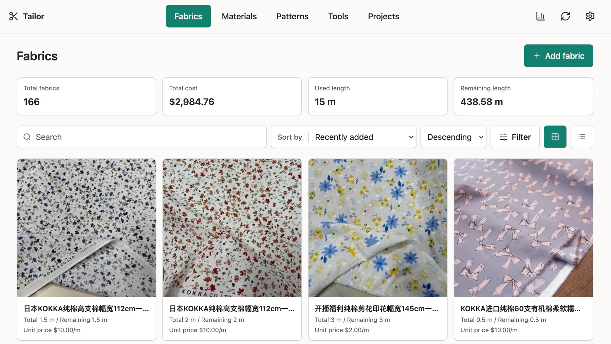
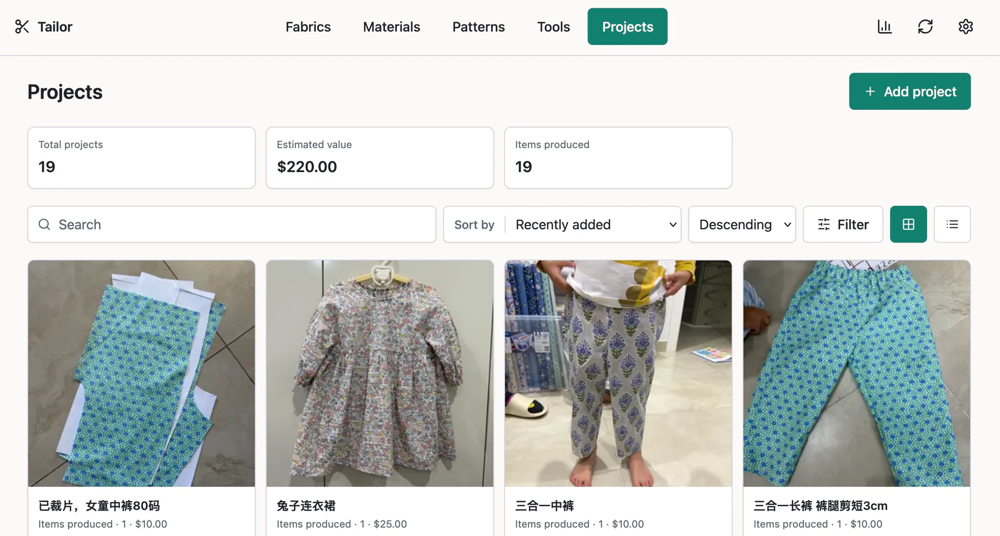
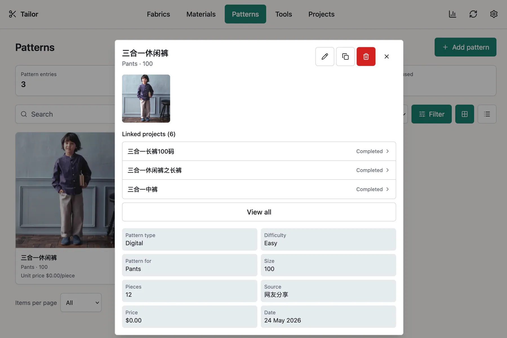

# Tailor

Tailor is a self-hosted sewing inventory application for fabrics, patterns,
materials, projects, and tools, designed to run as a single Docker container.
It is intended for one user and stores all data in a local SQLite database with
photos on disk.

On iPhone, open Tailor in Safari and choose **Share → Add to Home Screen**.
Tailor then launches in a standalone, app-like window and remains available
through an ordinary desktop browser from the same deployment.

**Interface languages:** English · 简体中文 · 繁體中文 · Français · Deutsch ·
日本語 · 한국어 · Italiano · Español · Português (Brasil) · Nederlands · Polski







## Internationalisation and units

Supported locales are `en-AU`, `en-GB`, `en-US`, `zh-CN`, `zh-TW`, `zh-HK`,
`fr`, `de`, `ja`, `ko`, `it`, `es`, `pt-BR`, `nl`, and `pl`.

Supported unit systems are `metric` and `imperial`. Supported currencies are
defined in `src/lib/currency-config.json`. Currency is a display interpretation
for all inventory values; changing it does not convert stored amounts.

## Features

- Inventory-specific fields, sorting, filtering, tags, photos, and duplication
- Project links to fabrics, patterns, and materials
- Fabric consumption and project cost calculations
- Metric and imperial display units
- Multiple interface languages and currencies
- Browser-based backup and restore
- Responsive PWA interface for desktop and mobile browsers

## Deployment model

Tailor runs as one Docker container with one persistent `/data` volume. It does
not require an external database, object store, cache, or queue.

Tailor does not currently provide a shared multi-user instance. To support
multiple people, run a separate container and `/data` volume for each user, or
wait for a future release with native multi-user support.

The Compose configuration binds the application to `127.0.0.1:3000`. Keep that
loopback binding and place an HTTPS reverse proxy such as Caddy, nginx, or
Traefik in front of it. Do not expose the container port directly to the
internet.

### Requirements

- Docker Engine with Docker Compose v2
- An HTTPS reverse proxy for non-local access
- A persistent Docker volume or bind mount for `/data`

### Configure

```bash
git clone https://github.com/d1scolor/tailor.git
cd tailor
cp .env.example .env
chmod 600 .env
```

Set a unique username, a password of at least 12 characters, and the canonical
URL used in the browser before starting the container. Tailor has no default
credentials. The canonical `compose.yml` loads these settings from `.env`.

| Variable              | Required   | Default                          | Purpose                                                          |
| --------------------- | ---------- | -------------------------------- | ---------------------------------------------------------------- |
| `INITIAL_USERNAME`    | First boot | none                             | Creates the first and only user                                  |
| `INITIAL_PASSWORD`    | First boot | none                             | Initial password; 12–72 UTF-8 bytes                              |
| `BASE_URL`            | Yes        | none                             | Exact browser origin used for request checks and cookie security |
| `TAILOR_IMAGE`        | No         | `ghcr.io/d1scolor/tailor:latest` | Image used by Compose                                            |
| `DEFAULT_LOCALE`      | No         | `en-AU`                          | Initial interface locale                                         |
| `DEFAULT_UNIT_SYSTEM` | No         | `metric`                         | `metric` or `imperial`                                           |
| `CURRENCY_CODE`       | No         | `USD`                            | Initial ISO 4217 currency code                                   |
| `MAX_UPLOAD_MB`       | No         | `20`                             | Maximum photo upload size                                        |
| `MAX_BACKUP_MB`       | No         | `4096`                           | Maximum compressed and extracted restore size                    |

Bootstrap credentials are ignored after the first user is created. Change the
password in Settings after the first login. Anyone with access to the Docker
daemon or the deployment environment can read container environment variables,
so restrict host access and protect `.env`.

For example, a Chinese-language deployment using CNY and the published image
can use:

```dotenv
TAILOR_IMAGE=ghcr.io/d1scolor/tailor:latest
INITIAL_USERNAME=tailor
INITIAL_PASSWORD=replace-with-a-long-unique-password
BASE_URL=https://tailor.example.com
DEFAULT_LOCALE=zh-CN
DEFAULT_UNIT_SYSTEM=metric
CURRENCY_CODE=CNY
MAX_UPLOAD_MB=20
MAX_BACKUP_MB=4096
```

`NODE_ENV=production` is already set by the image and does not need to be
repeated in Compose.

### Run the GHCR image

The published image is the default in `.env.example` and `compose.yml`:

```bash
docker compose pull
docker compose up -d --no-build
docker compose ps
```

Images published from this repository support `linux/amd64` and `linux/arm64`.
Prefer an immutable version or `sha-*` tag when repeatable deployments matter.

Published image channels are:

| Tag                 | Purpose                                                                      |
| ------------------- | ---------------------------------------------------------------------------- |
| `latest`            | Newest stable release; the default for self-hosting                          |
| `edge`              | Newest successfully published tip of `main`; intended for maintainer testing |
| `MAJOR.MINOR.PATCH` | Exact stable release, such as `0.2.0`                                        |
| `sha-<commit>`      | Exact image built from a `main` commit                                       |

`edge` may contain unannounced changes. Back up data before testing it.
Maintainers should follow
[the release procedure](docs/RELEASING.md); stable releases promote an existing
tested SHA image rather than rebuilding it.

### Build locally

Set `TAILOR_IMAGE=tailor:local` in `.env`, then run:

```bash
docker compose up -d --build
docker compose ps
```

### Reverse proxy

Proxy HTTPS traffic to `http://127.0.0.1:3000` and preserve the original `Host`
and scheme headers. Set the proxy request-body limit at least as high as the
largest photo or backup you intend to restore.

Example Caddy configuration:

```caddyfile
tailor.example.com {
    reverse_proxy 127.0.0.1:3000
}
```

Set `BASE_URL=https://tailor.example.com` to the same public origin.

To use host port `9010`, change the Compose port mapping to
`127.0.0.1:9010:3000` and proxy to `http://127.0.0.1:9010`. Bind to
`0.0.0.0:9010:3000` only when you intentionally want Tailor reachable through
every host network interface.

### Private network or VPN

HTTPS is recommended but is not required when Tailor is accessed directly
through a trusted private network or VPN. Set `BASE_URL` to the exact private
address, including its port:

```dotenv
BASE_URL=http://192.168.1.20:3000
```

For direct network access, change the Compose port mapping to
`0.0.0.0:3000:3000`. Tailor permits HTTP only for `localhost`, loopback,
private IPv4 addresses, link-local addresses, the `100.64.0.0/10` shared range
used by VPNs such as Tailscale, and private or link-local IPv6 addresses. A
public hostname or public IP address must use HTTPS.

With an HTTP `BASE_URL`, the session cookie cannot use the `Secure` attribute.
Credentials and sessions are therefore unencrypted unless the network or VPN
provides encryption. The configured origin check, HttpOnly cookie protection,
SameSite policy, and login rate limit remain enabled.

### Persistent data

Compose creates the named volume `tailor-data`, mounted at `/data`:

```text
/data/db/tailor.db
/data/photos/originals/
/data/photos/display/
/data/photos/thumbs/
```

To use a bind mount instead, replace `tailor-data:/data` with
`./data:/data`. The directory must be writable by UID/GID `1000:1000`, because
the application runs as the unprivileged `node` user.

Do not delete or replace `/data` during an upgrade.

## Backup and restore

Settings can download a `.tar.gz` backup and restore one created by Tailor.
Backups contain the password hash, inventory, and original photos and must be
handled as sensitive data. Active session tokens are removed from exported
backups, and restoring a backup invalidates all sessions.

Restore validates archive paths, entry types, size, SQLite integrity, and the
current schema before replacing live data. The previous data directory is
retained under `/data/restore-backup-*` for emergency rollback; remove old
restore backups from the Docker host after verifying a successful restore.
Backups from pre-public development builds are not supported by the public
schema baseline.

For large installations, also take host-level snapshots of the entire `/data`
volume while the container is stopped.

## Upgrades

Back up Tailor first. For GHCR deployments:

```bash
docker compose pull
docker compose up -d --no-build
```

For local builds:

```bash
git pull --ff-only
docker compose up -d --build
```

Container startup initializes an empty database or validates an existing
database against the current public schema.

## Local development

Use Node.js 24 LTS.

```bash
cp .env.example .env
npm ci
npm run dev
```

For local development, set `BASE_URL=http://127.0.0.1:3000` in `.env`. The
development server uses `./data` by default.

Useful checks:

```bash
npm run typecheck
npm run lint
npm test
npm run build
npm audit
```

## Security model

Tailor is single-user software intended to run behind an HTTPS reverse proxy or
on a trusted private network or VPN. It uses bcrypt password hashes, random
server-side sessions, HttpOnly SameSite cookies, cross-origin mutation checks,
and bounded login attempts. Session cookies use the `Secure` attribute whenever
`BASE_URL` uses HTTPS. The container runs without Linux capabilities as a
non-root user.

The application tracks failed logins by case-insensitive username. Eight
failures within 15 minutes block further attempts for that username for 15
minutes and return HTTP `429` with a `Retry-After` header. A successful login
clears the failures. This limiter is process-local and resets when the container
restarts, so internet-facing deployments should also rate-limit
`/api/auth/login` at the reverse proxy.

The unprotected `/api/health` endpoint only reports process availability.

See [SECURITY.md](SECURITY.md) for vulnerability reporting and supported
versions.

## Contributing

Forks and independent improvements are welcome. This repository does not accept
pull requests; see [CONTRIBUTING.md](CONTRIBUTING.md).

## License

Tailor is licensed under the [GNU Affero General Public License version 3
only](LICENSE) (`AGPL-3.0-only`).

You may use, modify, redistribute, and charge for Tailor or a hosted Tailor
service. Modified versions used over a network must offer their corresponding
source code to their users under the same license. Copyright and license
notices must be preserved. The canonical source is
[github.com/d1scolor/tailor](https://github.com/d1scolor/tailor).
